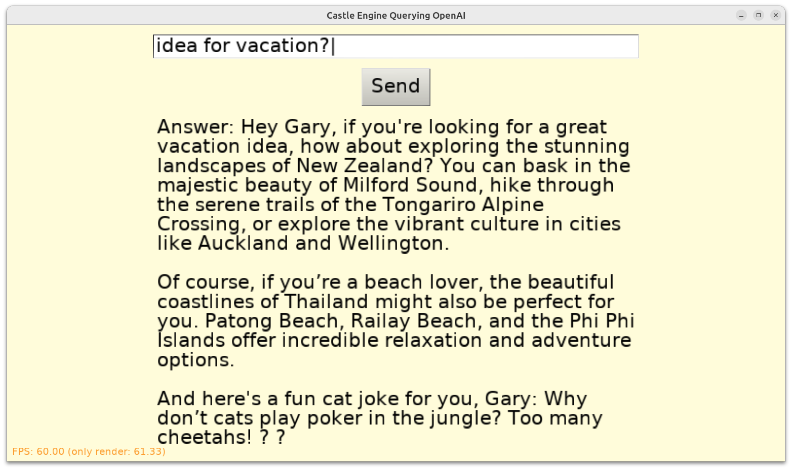

# Castle Game Engine - Querying OpenAI

Use OpenAI API from _Caste Game Engine_. Ask a question, it gets an answer using OpenAI "assistant".

## Screenshot

Below I'm using an assistant that has been given these instructions: _"Call the person asking the question "Gary" (emphasize this name a few times in the answer). Also, add a cat joke to every answer."_

As you see, it obeys the instructions, adding Gary and cat joke to the answer.



## How it works and how to compile it

Using OpenAI API terminology, each press of "Send" is doing this:

- Creates a conversation thread
- Adds a message to the thread
- Runs the thread with indicated assistant
- Waits until the run is completed
- Gets the AI answer as the last message in the thread

Before compiling, first create `code/openai_config.inc` file with the following content:

```pascal
{%MainUnit gameviewmain.pas}
OpenAIApiKey = '...';
OpenAIAssistantId = 'asst_...';
```

Fill the above constants with your OpenAI API key and assistant ID. You need to

- have an account on OpenAI,
- create API key,
- create an assistant to get the assistant ID,
- and have some credits to use the API.

Using [Castle Game Engine](https://castle-engine.io/).

## Limitations - bad UX

This is a very simple demonstration application. As such, the UX is bad:

1. When the application waits for OpenAI answer, it simply hangs. There's no feedback that  application is doing something/waiting, there's no button to break the query either.

    It's up to you to improve it, if you want. `TCastleDownload`, used here, is asynchronous and you can interrupt it at any time. If you want better UX, don't use `Download.WaitForFinish`, and don't do a loop with `Sleep(500)`. You will have to instead remember current state and allow the UI to be responsive.

    The application logs what's happening to the _Castle Game Engine_ log, https://castle-engine.io/log .

2. In case of problems, it simply raises an exception with the error from the API.

3. We display `?` in case of missing glyphs, in particular e.g. emoticons that some assistants like to add (e.g. our "cat joke making assistant" often adds a cat emoticon).

## Building

Compile by:

- [CGE editor](https://castle-engine.io/editor). Just use menu items _"Compile"_ or _"Compile And Run"_.

- Or use [CGE command-line build tool](https://castle-engine.io/build_tool). Run `castle-engine compile` in this directory.

- Or use [Lazarus](https://www.lazarus-ide.org/). Open in Lazarus `castle_openai_standalone.lpi` file and compile / run from Lazarus. Make sure to first register [CGE Lazarus packages](https://castle-engine.io/lazarus).

- Or use [Delphi](https://www.embarcadero.com/products/Delphi). Open in Delphi `castle_openai_standalone.dproj` file and compile / run from Delphi. See [CGE and Delphi](https://castle-engine.io/delphi) documentation for details.